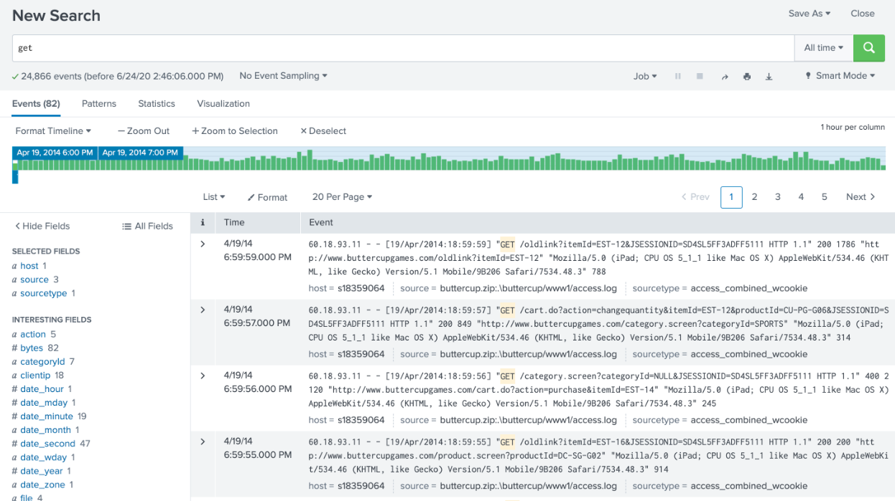
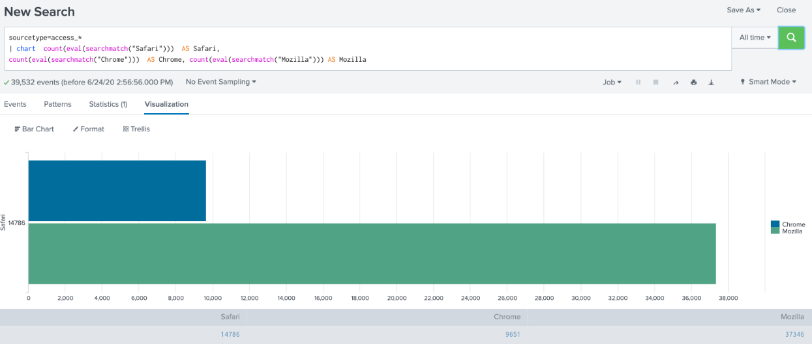

<h1>
    <a href="https://github.com/prsilvaa" target="_blank">
        Splunk Log Analysis
    </a>
</h1>

<h2>Project Objective</h2>

The objective of this project was to use Splunk to analyse web server logs and extract actionable business and security insights. This included learning SPL (Search Processing Language), performing searches, visualising trends, and identifying anomalies in web access data.

<h2>Tools Used</h2>
<ul>
    <li>Splunk Enterprise / Splunk Cloud</li>
    <li>SPL (Search Processing Language)</li>
    <li>Apache Web Logs</li>
    <li>Buttercup Dataset</li>
    <li>Charts and dashboards in Splunk</li>
</ul>

<h2>Skills Gained</h2>
<ul>
    <li>Search Processing Language (SPL) for data queries</li>
    <li>Log parsing and analysis</li>
    <li>Extracting client IPs, HTTP status codes, and user agents</li>
    <li>Timeline and transaction analysis</li>
    <li>Identifying successful and failed transactions</li>
    <li>Mapping product IDs to categories</li>
    <li>Building visualisations for business and security insights</li>
</ul>

<h2>Outcome</h2>

I successfully analysed the Buttercup web server dataset using Splunk. Key achievements included identifying the top client IP addresses, tracking HTTP response codes, mining for specific products and purchases, and visualising user behaviour and browser usage trends. This project enhanced my ability to extract meaningful insights from large datasets and strengthened my skills in log-based security monitoring and business intelligence.

    <h3>Failed Requests (Status=404)</h3>
    
    
Analysis showing the client IPs generating the most 404 errors.

    <h3>All GET Requests</h3>
    
    
Mining GET requests to track user activity and product interactions.

    <h3>Browser and OS Comparison</h3>
    
    
Comparison showing the usage trends for Windows vs Mac clients.

